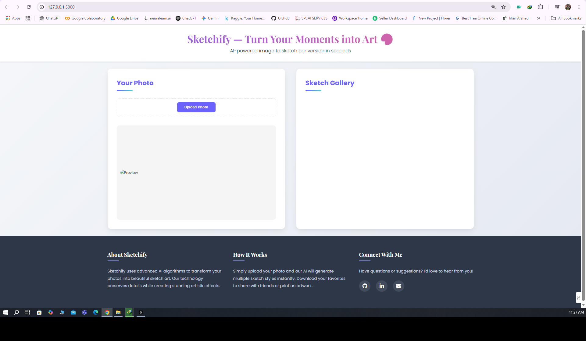
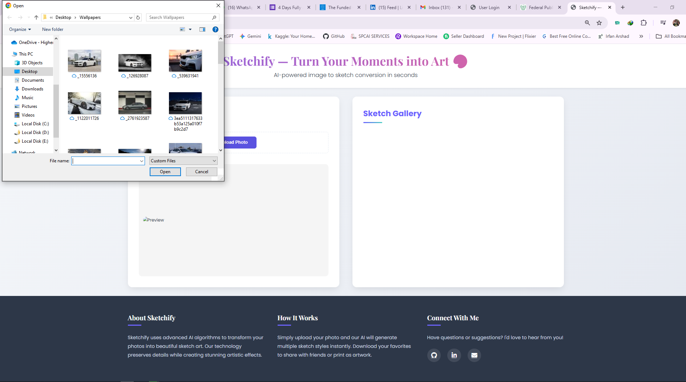
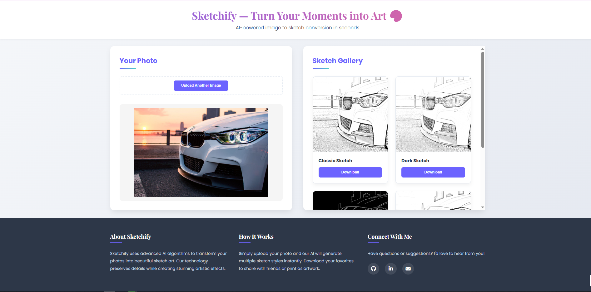

# 🎨 Sketchify - Image to Sketch Converter

Sketchify is a lightweight web application that transforms your images into beautiful pencil sketches using OpenCV and Flask. Perfect for learning computer vision and web deployment basics.

---

## 🚀 Features

- 📤 Upload an image (JPG or PNG)
- ✏️ Convert it to a pencil sketch using OpenCV
- 💾 Download the sketched image
- 🖥️ Simple, fast, and user-friendly interface

---

```
📁 Project Structure
Sketchify/
├── static/
│   ├── Outputs
│   └── uploads
├── templates/
│   └── index.html
├── Screenshots/
│   ├── S1.png
│   ├── S2.png
│   ├── Output1.png
│   └── Output2.png
├── app.py
├── sketch_processor.py
├── requirements.txt
└── README.md
```

---

## 🔍 Demo

🏠 Homepage  


📤 Image Upload Page  


🖼️ Sketch Output Example 1  


🖼️ Sketch Output Example 2  


---

## 📦 Requirements

Python 3.8+

Flask

OpenCV (cv2)

---

##  🙋‍♂️ Author

Irfan Arshad
GitHub: @Irfan-arshad-1122
